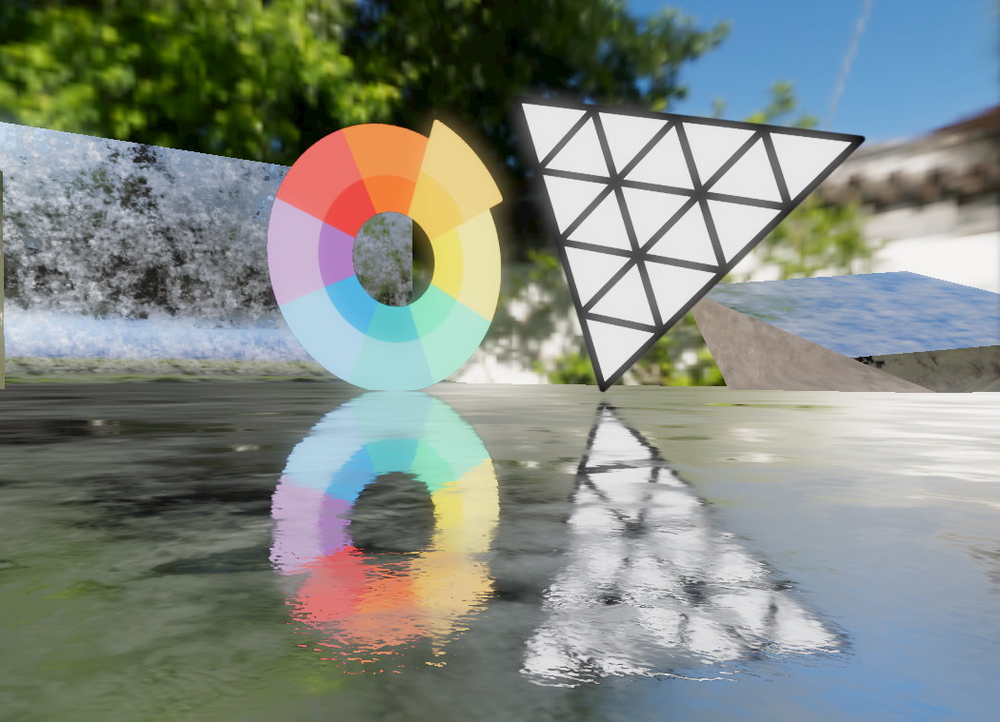

# Billboard Reflection
Implements performant reflections for simple planes in three.js.
\
\
The name derives from billboards for which this technique can ideally be used
as seen in the [Unreal Engine 3: Samaritan Demo](https://youtu.be/RSXyztq_0uM?t=12).
The benefit of this technique is that any mesh with any orientation can reflect these planes correctly.
\
\

## Installation
The build (UMD and module version) is located in the [/dist](dist/) directory.

## Usage
```javascript
import BillboardReflection from "./BillboardReflection"

let billboardReflection = new BillboardReflection()

billboardReflection.create(billboardMesh)
billboardReflection.create(otherBillboardMesh, options)

mesh.material.onBeforeCompile = shader => billboardReflection.enableReflection(shader)
```
This will make `mesh` reflect `billboardMesh` and `otherBillboardMesh`.

## Options
Options for <b>BillboardReflection.create(mesh, options)</b>

Default values:
```javascript
{
    rayFalloff: 0,
    color: undefined, // will use reflecting mesh's color if undefined
    opacity: undefined, // will use reflecting mesh's opacity if undefined
    visible: undefined // will use reflecting mesh's visibility if undefined
}
```
Description:
- `rayFalloff`: how much the ray falls off by distance, higher values will make it fade out faster
- `color`: multiplies the reflection color with the given color, if it is undefined, the mesh's material color will be used
- `opacity`: the opacity of the reflection, if it is undefined, the mesh's material opacity will be used
- `visible`: whether the reflection is visible, if it is undefined, the mesh's visibility (namely its _visible_ property and its material's _visible_ property) will be used

<br>
Options for <b>BillboardReflection.enableReflection(shader, options)</b>

Default values:
```javascript
{
    roughnessMapBlur: true,
    roughnessMapBlurIntensity: 0.85,

    roughness: undefined, // will use reflecting mesh's roughness if undefined
    envMapIntensity: undefined // will use reflecting mesh's envMapIntensity if undefined
}
```

Description:
- `roughnessMapBlur`: whether to blur reflections using low-res mipmaps (see [Limitations](https://github.com/0beqz/three-billboard-reflection#roughness) section for more information)
- `roughnessMapBlurIntensity`: if roughnessMapBlur is enabled, how much a material should be blurred for higher roughness values, higher values will blur a reflection more but will result in more artifacts
- `roughness`: overwrite roughness value for a reflection, if it's undefined, the material's *roughness* value will be used
- `envMapIntensity`: overwrite envMapIntensity value for a reflection, if it's undefined, the material's *envMapIntensity* value will be used


## Reflection for just a texture and matrix
If your reflecting objects are not meshes (e.g. all billboards are batched into a single mesh)
then you can use a texture and a matrix to create reflections for each billboard:
```javascript
let position = new Vector3(1, 0, 0)
let rotation = new Quaternion().setFromEuler(new Euler(0, 1, 0))
let scale = new Vector3(1, 1, 1)

let matrix = new Matrix4().compose(position, rotation, scale)

billboardReflection.createFromTextureAndMatrix(texture, matrix)
```
This will give the same reflection as a mesh at the given position with the given rotation and scale.

## Limitations
There are limitations regarding roughness and occlusion due to performance reasons.
### Roughness
Proper roughness support is missing so reflections aren't blurred on rough surfaces but fade out.
If there's a roughness map then blur is achieved through using low-res mipmaps of a billboard texture
for rough spots which gives acceptable results when there aren't too many rough spots.
This does not work for video textures as these don't have mipmaps.

If your material has a roughness map but you don't want to use blur, then you can have it toggled off like so:
```javascript
material.onBeforeCompile = shader => billboardReflection.enableReflection(shader, { roughnessMapBlur: false })
```
This will now only make the reflection fade out for higher roughness values.

### Occlusion
There's no occlusion check for reflections so they can be visible behind other meshes. This can
be counteracted by giving these meshes reflections too or increasing the reflection's `fallOff` value.

## References
Papers and articles
- BBR algorithm: https://kola.opus.hbz-nrw.de/opus45-kola/frontdoor/deliver/index/docId/908/file/BA_GuidoSchmidt.pdf
- Ray / triangle intersection: http://www.graphics.cornell.edu/pubs/1997/MT97.pdf
- https://blog.selfshadow.com/publications/s2013-shading-course/karis/s2013_pbs_epic_notes_v2.pdf

Slides
- https://docs.unrealengine.com/udk/Three/rsrc/Three/DirectX11Rendering/MartinM_GDC11_DX11_presentation.pdf

## Credits
### Algorithm
- [Guido Schmidt. Rendering view dependent reflections using the
graphics card](https://kola.opus.hbz-nrw.de/opus45-kola/frontdoor/deliver/index/docId/908/file/BA_GuidoSchmidt.pdf)

### Demo Scene
- Textures: https://ambientcg.com
- HDR: https://polyhaven.com/hdris
- Color Wheel Icon: https://www.freepik.com